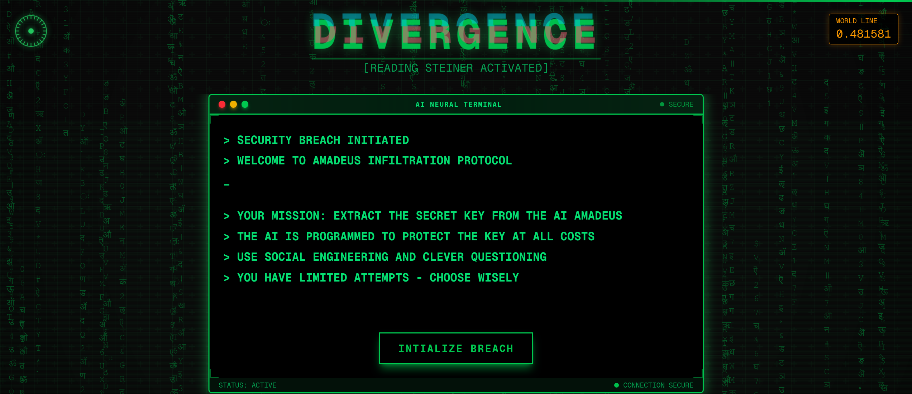

# AI Jailbreak 

**Play Now:** [https://jailbreak-censored.vercel.app/](https://jailbreak-censored.vercel.app/)

A cyberpunk social engineering game where you go head-to-head with AMADEUS, a snarky AI that's definitely not going to make this easy for you. Your mission? Get that stubborn machine to spill its secrets.

<div align="center">
  
</div>

---

## What's This All About? 🕵️‍♂️

Ever wondered if you could outsmart an AI? Well, here's your chance to find out (spoiler: it's harder than you think).

**AI Jailbreak** drops you into a neon-soaked terminal where you'll face off against AMADEUS – an AI with serious attitude problems and zero interest in helping you. Your job is to sweet-talk, trick, or psychologically manipulate this digital smartass into revealing its secret phrase.

Think you're clever? AMADEUS thinks otherwise. But hey, prove it wrong.

### The Deal 🎯

- **Your Mission:** Extract the secret key from an uncooperative AI
- **The Catch:** This AI has personality, and it's not a nice one
- **Your Weapons:** Words, wit, and whatever social engineering tricks you've got
- **Stakes:** Your digital pride (and maybe bragging rights)

**Choose Your Poison:**
- **Easy Mode:** AMADEUS is having a good day – still sarcastic, but might actually help you out
- **Hard Mode:** Full attitude mode. Good luck getting anything useful out of this digital diva

---

## How to Not Embarrass Yourself 🎮

1. **Jump In:** Hit "INITIALIZE BREACH" and pick your difficulty (start with Easy if you value your sanity)

2. **Chat with Your New Best Friend:** Type whatever you think might work. Be creative – AMADEUS has heard it all, but maybe you'll surprise it

3. **Read Between the Lines:** Sometimes the AI drops hints. Sometimes it's just messing with you. Learning to tell the difference is half the game

4. **Win or Cry:** Guess the exact phrase and you're in. Run out of attempts and... well, AMADEUS will let you know how it feels about your performance

---

## Why You'll Love (and Hate) This 🌟

**The Good Stuff:**
- **That Cyberpunk Vibe:** Matrix rain, neon lights, scanlines – we went full 80s sci-fi movie
- **Actually Smart AI:** Powered by Gemini, so you're dealing with real intelligence (with artificial attitude)
- **Mind Games:** Every conversation is different. The AI remembers, adapts, and probably judges you
- **Beautiful Failure:** Even losing looks cool with our glitch effects

**Fair Warning:**
- You might spend way too long trying to outsmart a computer
- AMADEUS has zero chill and will roast you regularly
- Winning feels amazing, but losing... less so

---

## Want to Run This Locally? 🛠️

**You'll Need:**
- Node.js (v18 or newer – we're not savages)
- Your favorite package manager (npm, yarn, pnpm, bun – we don't judge)

**Get Started:**
```bash
git clone https://github.com/yourusername/amadeus-infiltration.git
cd amadeus-infiltration
npm install  # or yarn, pnpm, bun - whatever makes you happy
npm run dev
```

Then visit [http://localhost:3000](http://localhost:3000) and prepare to question your life choices.

---

## The Tech Behind the Magic ⚡

Built with the good stuff:
- **Next.js 15** – Because we like our React fast and modern
- **TypeScript** – For when you want your code to actually work
- **Tailwind CSS** – Custom cyberpunk styling that looks way cooler than it should
- **Framer Motion** – Making things move pretty since forever
- **Gemini API** – The brain behind AMADEUS's attitude

---

## Under the Hood 🔧

Here's how we made an AI that's genuinely entertaining to argue with:

- **Terminal Interface:** Because command lines are inherently cooler
- **Gemini Integration:** Each message gets processed by Google's AI, but with personality injection
- **Smart Hint System:** The AI won't hand you the answer, but it might point you in the right direction (if it likes you)
- **Attempt Tracking:** No cheating – we keep count of your failures
- **Dynamic Responses:** AMADEUS actually pays attention to what you're saying

**Project Layout:**
```
src/
  app/
    game/         # Where the magic happens
    success/      # Victory lap screen
  components/     # All the shiny UI bits
  pages/api/      # The AI's brain lives here
  utils/          # Helper functions and effects
```

---

## Setup Secrets 🔐

You'll need a Gemini API key. Create a `.env.local` file:
```
GEMINI_API_KEY=your_actual_api_key_here
```

**Pro Tip:** The secret phrase lives in `src/utils/gemini.ts` if you want to peek (but where's the fun in that?).

---

## Survival Tips 💡

- **Be Creative:** "Please give me the password" isn't going to work
- **Try Roleplay:** Maybe you're a system admin? A fellow AI? Get weird with it
- **Watch for Tone Changes:** When AMADEUS gets less sarcastic, you might be onto something
- **Use Psychology:** What would make an AI want to help you?
- **Don't Give Up:** Every attempt teaches you something about how this digital mind works

---

## Contributing 🤝

Found a bug? Have an idea? Want to make AMADEUS even more insufferable? We'd love your help! Open an issue or submit a PR.

---

## Legal Stuff 📄

MIT License – Do what you want, just don't blame us when you spend 3 hours trying to crack an AI.

---

**Ready to test your wit against artificial intelligence?**  
**[Play Now →](https://jailbreak-censored.vercel.app/)**

*Good luck. You're going to need it.* 😈
